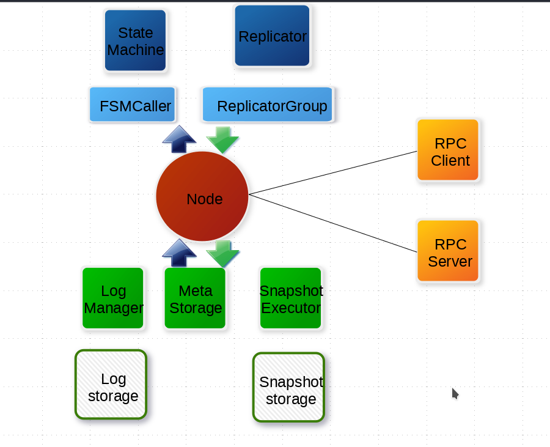

如图:
## 

### Node
Raft 分组中的一个节点，连接封装底层的所有服务，用户看到的主要服务接口，特别是 `apply(task)` 用于向 raft group 组成的复制状态机集群提交新任务应用到业务状态机。

## 存储
1. Log 存储，记录 raft 配置变更和用户提交任务的日志，将从 Leader 复制到其他节点上。LogStorage 是存储实现， LogManager 负责对底层存储的调用，对调用做缓存、批量提交、必要的检查和优化。
2. Meta 存储，元信息存储,记录 raft 实现的内部状态，比如当前 term,、投票给哪个节点等信息。
3. Snapshot 存储,，用于存放用户的状态机 snapshot 及元信息，可选。 SnapshotStorage 用于 snapshot 存储实现， SnapshotExecutor 用于 snapshot 实际存储、远程安装、复制的管理。

## 状态机
1. StateMachine： 用户核心逻辑的实现,核心是 `onApply(Iterator)` 方法，应用通过 `Node#apply(task)` 提交的日志到业务状态机。
2. FSMCaller： 封装对业务 StateMachine 的状态转换的调用以及日志的写入等，一个有限状态机的实现，做必要的检查、请求合并提交和并发处理等。

## 复制
1. Replicator： 用于 leader 向 follower 复制日志，也就是 raft 中的 appendEntries 调用，包括心跳存活检查等。
2. ReplicatorGroup:  用于单个 RAFT Group 管理所有的 replicator，必要的权限检查和派发。

## RPC
RPC 模块用于节点之间的网络通讯:
1. RPC Server: 内置于 Node 内的 RPC 服务器，接收其他节点或者客户端发过来的请求，转交给对应服务处理。
2. RPC Client: 用于向其他节点发起请求，例如投票、复制日志、心跳等。
